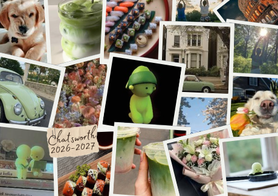

# me-in-markmedown
## Letter to My Teacher

Hi, my name is Isabella Rose and I am a freshman.
There is a lot of things I could share. My favorite colors are *GREEN* and *BROWN*. I play volleyball and love listening to music. I watch lots of movies and TV shows like *Gilmore Girls* and *My Life with the Walter Boys*. I also am a big fan of musicals. As you know I am also a reading addict, my current favorte genres are rom-coms and murder mysterys.

I am half Korean, a quarter Italian, and a quarter mixed. My dream trip is visit my family in both Italy and Korea. I would love to spend 2 weeks in each place. That way I am able to really spend time with my family and get an overall unfrogettable trip. I haven't really been outside of the US other than going to canada for a day so this trip would be really special.

Here are my current favorite song- https://open.spotify.com/playlist/5eUugQ6gbDEG8DPukyJpNn?si=Mo3zPrs9T6-cC6diGig5xQ&utm_source=copy-link

<strong style="color:#0000FF"> Some more info 5 of those songs.</strong>

|  |Track Name | Artist | Raiting (⭐⭐⭐⭐⭐) | Blurb |
| - | - | - | - | - |
| 1 | "Washington on Your Side" | Leslie Odom Jr., Daveed Diggs, Okieriete Onaodowan, Cast of Hamilton | ⭐⭐⭐⭐ | Kinda had a hamilton phase, still think this song is amazing. |
| 2 | "Piragua" | Lin-Manuel Miranda | ⭐⭐⭐⭐ | I love this song, really gets me in the singing mood and will never miss. |
| 3 | "Billyeoon Goyangi (Do the Dance)" | ILLIT | ⭐⭐⭐ | This song is by one of my favorite kpop groups. No other words are needed. |
| 4 | "Black or White" | Micheal Jackson | ⭐⭐⭐ | I love this song, Micheal Jackson was my childhood favorite. |
| 5 | "Your Obedient Servant" | Leslie Odom Jr. Lin-Manuel Miranda, Cast of Hamilton | ⭐⭐⭐⭐ | This song is a masterpiece, I cannot stress this enough ***BEST SONG EVERY***. |

## Things I Like (Image collage)

This collage has things I love, smiskis, matcha, dogs, cars, sushi, flowers, and gorgeous buildings.